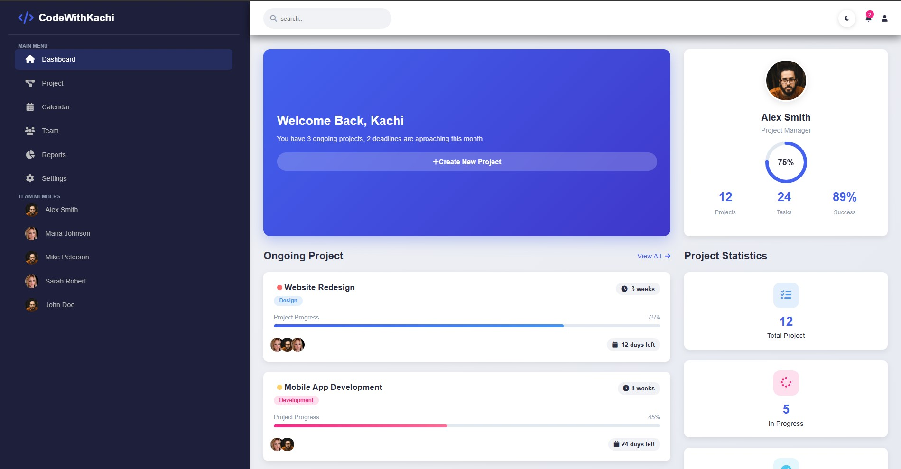

# 🧮 Responsive Admin Dashboard

A modern, responsive admin dashboard built with **HTML**, **CSS**, and **JavaScript**. This project simulates a real-world dashboard interface with features like sidebar toggling, theme switching, loading screen, and a timeline layout — all built from scratch with no frameworks.



Optional code highlight:


---

## ✨ Features

- Responsive layout for all screen sizes
- Sidebar toggle with hamburger menu
- Light/Dark theme switcher (with localStorage persistence)
- Timeline section with scrollable grid and task bars
- Loader screen with fade-in dashboard reveal
- Modular, clean CSS architecture

---

## 🚀 Live Demo

👉 [View it Live]()

---

## 🛠️ Tech Stack

- HTML5
- CSS3 (Custom Properties, Flexbox, Grid)
- JavaScript (DOM, Events, LocalStorage)

---

## 📁 Folder Structure

```bash
📦dashboard
 ┣ 📁assets
    ┣ 📁css
    ┣ 📁images
    ┣ 📁js
 ┣ index.html
 ┗ README.md
